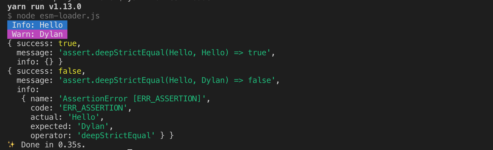

# ESM Project

Node app using new [esm](https://github.com/standard-things/esm) module loader

### Info

> This ES Module uses the new [esm](https://github.com/standard-things/esm) module loader by [John-David Dalton](https://github.com/jdalton)


> See his release [post](https://medium.com/web-on-the-edge/tomorrows-es-modules-today-c53d29ac448c)
and [video](https://www.youtube.com/watch?v=JcZ-FzfDq8A#t=5) for details.


### Install

yarn (recommended)
```shell
yarn add @flavioespinoza/ems-project
```

npm
```shell
npm i @flavioespinoza/log_log
```

### Enable 

Enable `esm` loader for local runs
```shell
node -r esm esm-loader.js
```

### Run
```shell
yarn esm-loader

"or"

yarn run esm-loader
```

console output should look something like this

